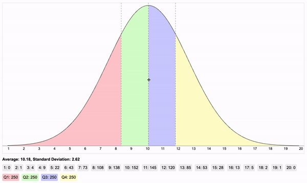

# Normal Distribution Visualiser

A customizable, interactive JavaScript component for visualising normal distribution curves.




## Features

- Interactive graph with draggable mean and standard deviation
- Customizable appearance (colors, dimensions, etc.)
- Display of quartiles, individual values, and statistics
- Responsive design
- Calculation of normal distribution values and quartiles

## Installation

1. Clone this repository or download the `NormalDistributionVisualiser.js` file.
2. Include the script in your HTML file:

    ```html
    <script src="path/to/NormalDistributionVisualiser.js"></script>
    ```

## Usage

1. Create a container element in your HTML:

    ```html
    <div id="visualiser-container"></div>
    ```

2. Initialize the visualiser in your JavaScript:

    ```javascript
    const visualiser = new NormalDistributionVisualiser('visualiser-container', {
        // Optional configuration options
    });
    ```

## Configuration Options

| Option | Type | Default | Description |
|--------|------|---------|-------------|
| width | number | 1140 | Width of the canvas in pixels |
| height | number | 570 | Height of the canvas in pixels |
| min | number | 1 | Minimum value on the x-axis |
| max | number | 13 | Maximum value on the x-axis |
| average | number | 7 | Initial mean of the distribution |
| standardDeviation | number | 2 | Initial standard deviation |
| totalRecords | number | 500 | Total number of records for calculations |
| quartileColors | array | ['rgba(255, 0, 0, 0.2)', 'rgba(0, 255, 0, 0.2)', 'rgba(0, 0, 255, 0.2)', 'rgba(255, 255, 0, 0.2)'] | Colors for each quartile |
| curveColor | string | 'blue' | Color of the distribution curve |
| showStats | boolean | true | Show statistics (mean and standard deviation) |
| showValues | boolean | true | Show individual values |
| showQuartiles | boolean | true | Show quartile information |
| interactive | boolean | true | Allow interactive dragging to change mean and standard deviation |

## Methods

- `updateGraph()`: Recalculates and redraws the graph
- `getValues()`: Returns an object containing all calculated values

## Example

```javascript
const visualiser = new NormalDistributionVisualiser('visualiser-container', {
    min: 0,
    max: 10,
    average: 5,
    standardDeviation: 1.5,
    quartileColors: ['#ffcccb', '#90ee90', '#add8e6', '#ffffe0'],
    curveColor: '#333333'
});

```
## Demo
View sample code in Example Directory


## License and Attribution

This project is licensed under the MIT License. 

When using the Normal Distribution Visualiser in your work, please cite it as follows:

### Harvard Referencing Format

Lloyd, A., 2024. Normal Distribution Visualiser. [online] GitHub. Available at: <https://github.com/Alloyd21/NormalDistributionVisualiser> [Accessed Date].


For in-text citations, you can use:

(Lloyd, [year])

### Example

Lloyd, A., 2024. Normal Distribution Visualiser. [online] GitHub. Available at: <https://github.com/Alloyd21/NormalDistributionVisualiser> [Accessed 23 July 2024].

In-text citation: (Lloyd, 2024)


# Links

NPM: https://www.npmjs.com/package/normaldistributionvisualiser

GitHub: https://github.com/Alloyd21/NormalDistributionVisualiser